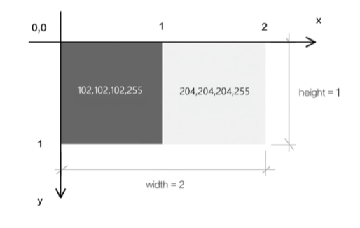
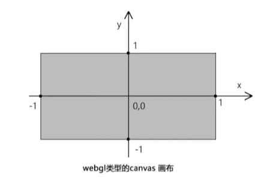

# webgl 入门

## 第一章   webgl概述

### 1. webgl是什么？

webgl是在网页上绘制和渲染三维图形的技术，可以让用户与其进行交互。

### 2.webgl的行业应用案例

+ 3D数据可视化： https://cybermap.kaspersky.com

+ 居家卖场：https://showroom.littleworkshop.fr/

+ 天猫宣传页：https://shrek.imdevsh.com/show/tmall/

+ 小米su7：
  + https://su7-replica.netlify.app/#furina
  + https://su7-replica.netlify.app/
  + 原地址： https://gamemcu.com/su7/

+ 亿城燕西华府：https://beyond.3dnest.cn/newhouse/?m=0dfa839a_2rCb_b6f9

  

## 第二章 webgl最短教程

### 1. 刷底色的基本步骤

+ 在html中创建canvas画布

```html
<canvas id="canvas"></canvas>
```

+ 在js中获取canvas画布

```js
const canvas = document.querySelector("#canvas")
```

+ 使用canvas获取webgl绘图上下文

```js
const gl = canvas.getContext("webgl");
```

+ 指定将要用来清空绘图区的颜色

```js
gl.clearColor(0,0,0,1)
```

+ 使用之前指定的颜色，清空绘图区

```js
gl.clear(gl.COLOR_BUFFER_BIT);
```

##### 关键代码

```html
<canvas id="canvas"></canvas>
<script>
	// 获取画布
	const canvas = document.querySelector('#canvas')
    canvas.width = window.innerWidth
    canvas.height = window.innerHeight
	// 获取三维画笔
	const gl = canvas.getContext('webgl')
	// 指定将要用来清空绘图区的颜色
    // clearColor(r,g,b,a)中的参数是红、绿、蓝、透明度，其定义域是[0.1]
	gl.clearColor(1, 1, 0, 1)
	// 使用之前指定的颜色，清空绘图区
	gl.clear(gl.COLOR_BUFFER_BIT)
</script>
```

### 2. 灵活操作webgl中的颜色

```js
// 设置随机初始初始值
const rgbaCss = `rgba(${Math.floor(Math.random() * 256)}, ${Math.floor(Math.random() * 256)}, ${Math.floor(Math.random() * 256)}, 1)`
const reg = RegExp(/\((.*)\)/)
const rgbaStr = reg.exec(rgbaCss)[1]
const rgbaArr = rgbaStr.split(',').map((item) => parseInt(item))
const r = rgbaArr[0] / 255
const g = rgbaArr[1] / 255
const b = rgbaArr[2] / 255
const a = rgbaArr[3]
// 指定将要用来清空绘图区的颜色
gl.clearColor(r, g, b, a)
// 使用之前指定的颜色，清空绘图区
gl.clear(gl.COLOR_BUFFER_BIT)
```

### 3. 案例：多姿多彩的画布

+ 引入Color对象

```js
import { Color } from 'https://unpkg.com/three/build/three.module.js'
```

+ 实例化Color对象

```js
// 实例化Color对象
const color = new Color('rgba(255, 0, 0, 1)')
```

+ 建立色相偏移动画

```js
// 色相偏移动画
!(function ani() {
    // 颜色偏移
    color.offsetHSL(0.01, 0, 0)
    // 声明颜色 rgba
    gl.clearColor(color.r, color.g, color.b, 1)
    // 刷底色
    gl.clear(gl.COLOR_BUFFER_BIT)
    requestAnimationFrame(ani)
})()
```

### 4. webgl坐标系

> webgl画布的建立和获取，和canvas 2d是一样的
>
> canvas 2d画布和webgl 画布使用的坐标系都是二维直角坐标系，只不过它们坐标原点、y轴的坐标方向，坐标基底都不一样了。

#### 4-1 canvas 2d画布的坐标系

+ canvas 2d 坐标系的原点在左上角
+ canvas 2d 坐标系的y轴方向是朝下的
+ canvas 2d 坐标系的坐标基底有两个分量，分别是一个像素的宽和一个像素的高，即1个单位的宽便是一个像素的宽，1个单位的高便是一个像素的高。

如下图，下图两个方块表示两个像素：



 #### 4-2 webgl的坐标系

+ webgl坐标系的坐标原点在画布中心
+ webgl坐标系的y轴方向是朝上的
+ webgl坐标基底中的两个分量分别是半个canvas的宽和canvas的高，即1个单位的宽便是半个canvas的宽，1个单位的高便是半个canvas的高。

如下图：




##  第三章 webgl最简单的圆形 — 画一个点

点是最简单的形状，是几何图形最基本的组成部分。

接下来咱们就说一下在webgl画布上如何画一个点

#### 1. canvas绘图的基本步骤

+ 获取canvas画布
+ 获取二维画笔
+ 设置画笔颜色
+ 绘制形状

```js
const canvas = document.querySelector('#canvas')
const ctx = canvas.getContext('2d')
ctx.fillStyle = 'red'
ctx.fillRect(20, 20, 100, 100)
```


### 2. canvas 2d和webgl绘图的差异

浏览器有三大线程：js引擎线程、GUI渲染线程、浏览器事件触发线程。

其中GUI渲染线程就是用于渲图的，在这个渲染的线程里，有负责不同渲染工作的工人。比如有负责渲染HTML+CSS的工人，有负责渲染二维图形的工人，有负责渲染三维图形的工人。

负责渲染二维图形的工人说的是js语言。

负责渲染三维图形的工人说的是GLSL ES语言

### 3. webgl的绘图思路

+ 找一台电脑 - 浏览器里内置的webgl渲染引擎，负责渲染webgl图形，只认GLSL ES语言
+ 找一块手绘板 - 程序对象，承载GLSL ES语言，翻译GLSL ES语言和js语言，使两者可以互相通信
+ 找一支触控笔 - 通过canvas获取的webgl类型的上下文对象，可以向手绘板绘图命令，并接收手绘板的状态信息
+ 开始画画 - 通过webgl类型的上下文对象，用js画画

### 4. webgl的绘图步骤

```js
// 顶点着色器
const Vertext = `
void main() {
    gl_Position = vec4(0.0, 0.0, 0.0, 1.0);
    gl_PointSize = 100.0;
}
`
// 片元着色器
const Fragment = `
void main() {
  gl_FragColor = vec4(1.0, 0.0, 0.0, 1.0);
}
`

// webgl绘制
function initWebgl() {
  const canvas = document.querySelector('#webgl')
  // 三维画笔
  const gl = canvas.getContext('webgl')

  // 初始化着色器
  // 功能： 解析着色器文本，整合到程序对象里，关联webgl上下文对象，实现两种语言的通信
  initShader(gl, Vertext, Fragment)

  // 声明颜色 rgba
  gl.clearColor(0, 0, 0, 1)
  // 刷底色
  gl.clear(gl.COLOR_BUFFER_BIT)

  // 绘制顶点
  gl.drawArrays(gl.POINTS, 0, 1)
}

// 初始化着色器
function initShader(gl, vertexShaderText, fragmentShaderText) {
  // 创建程序对象
  const program = gl.createProgram()
  // 建立着色器对象
  const vertexShader = loadShader(gl, gl.VERTEX_SHADER, vertexShaderText)
  const fragmentShader = loadShader(gl, gl.FRAGMENT_SHADER, fragmentShaderText)
  // 把顶点着色对象装进程序对象中
  gl.attachShader(program, vertexShader)
  // 把片元着色对象装进程序对象中
  gl.attachShader(program, fragmentShader)
  // 把程序对象关联到上下文对象中
  gl.linkProgram(program)
  // 启动程序对象
  gl.useProgram(program)
  // 将程序对象挂载到上下文对象上
  gl.program = program
  return true
}
```

