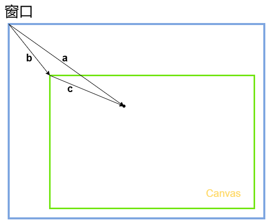

# 第一章 js 与着色器间的数据传输

## 1. attribute 变量的概念

回顾一下我们上一篇中点的定位：

```glsl
gl_Position = vec4(0,0,0,1);
```

这是一种将数据写死了的硬编码，缺乏可扩展性。

我们要让这个点位可以动态改变，那就得把它变成 attribute 变量。

attribute 变量是只有顶点着色器才能使用它的。

js 可以通过 attribute 变量向顶点着色器传递与顶点相关的数据。

## 2. js 向 attribute 变量传参的步骤

- 在顶点着色器中声明 attribute 变量。

```js
const vertex = `
    attribute vec4 a_Position;
    void main(){
        gl_Position = a_Position;
        gl_PointSize = 50.0;
    }
`;
```

- 在 js 中获取 attribute 变量

```js
const a_Position = gl.getAttribLocation(gl.program, "a_Position");
```

- 修改 attribute 变量

```js
gl.vertexAttrib3f(a_Position, 0.0, 0.5, 0.0);
```

### 整体代码

```js
import { initShader } from "./utils/index";
import { useWebgl } from "@/hooks/useClass01";

const { initShaders } = useWebgl();
const vertex = `
  attribute vec4 a_Position;
  void main(){
    gl_Position = a_Position;
    gl_PointSize = 50.0;
  }
`;
const fragment = `
  void main(){
    gl_FragColor = vec4(1.0, 0.0, 0.0, 1.0);
  }
`;

const canvas = document.getElementById("canvas");
canvas.width = window.innerWidth;
canvas.height = window.innerHeight;
const gl = canvas.getContext("webgl");
initShaders(gl, vsSource, fsSource);
const a_Position = gl.getAttribLocation(gl.program, "a_Position");
gl.vertexAttrib3f(a_Position, 0.0, 0.0, 0.0);
gl.clearColor(0.0, 0.0, 0.0, 1.0);
gl.clear(gl.COLOR_BUFFER_BIT);
gl.drawArrays(gl.POINTS, 0, 1);
```

## 3. js 向 attribute 变量传参的原理

### 3.1. 着色器中定义的 attribute 变量

```glsl
attribute vec4 a_Position;
void main() {
  gl_Position = a_Position;
  gl_PointSize = 10.0;
}
```

- attribute 是存储限定符，是专门用于向外部导出与点位相关的对象的，这类似于 es6 模板语法中 export 。
- vec4 是变量类型，vec4 是 4 维矢量对象
- a_Position 是变量名，之后在 js 中会根据这个变量名导入变量。这个变量名是一个指针，指向实际数据的存储位置。也是说，我们如果在着色器外部改变了 a_Position 所指向的实际数据，那么在着色器中 a_Position 所对应的数据也会修改。

### 3.2 着色器中定义的变量，在 js 中如何获取？

因为着色器和 js 是两个不同的语种，着色器无法通过 window.a_Position 原理向全局暴露变量。

```js
const a_Position = gl.getAttribLocation(gl.program, "a_Position");
```

- gl 是 webgl 的上下文对象
- gl.getAttribLocation()是获取着色器中 attribute 变量的方法
- getAttribLocation()方法接收两个参数:
  - gl.program 是初始化着色器时，在上下文对象上挂载的程序对象
  - a_Position 是 着色器暴露出来的变量名。

### 3.3 在 js 中修改 attribute 变量

在 webgl 中，我们用特定的方法修改 a_Position 变量的值。

```js
gl.vertexAttrib3f(a_Position, 0.0, 0.5, 0.0);
```

- gl.vertexAttrib3f()是修改 a_Position 变量的方法
- gl.vertexAttrib3f()接收三个参数:
  - a_Position 是 着色器暴露出来的变量名。
  - x,y,z 是 a_Position 变量要修改的值。
    > a_Position 被修改之后，我们就可以使用上下文对象绘制的最新点位了

```js
gl.clearColor(0.0, 0.0, 0.0, 1.0);
gl.clear(gl.COLOR_BUFFER_BIT);
gl.drawArrays(gl.POINTS, 0, 1);
```

## 4. 扩展

### 4.1 vertexAttrib3f()的同族函数

> gl.vertexAttrib3f(location, v0, v1, v2)方法是一系列修改着色器中的 attribute 变量的方法之一，它还有许多同族方法，比如：

```glsl
gl.vertexAttrib1f(location, v0);
gl.vertexAttrib2f(location, v0, v1);
gl.vertexAttrib3f(location, v0, v1, v2);
gl.vertexAttrib4f(location, v0, v1, v2, v3);
```

### 4.2 webgl 函数的命名规律

GLSL ES 里函数的命名结构是：<基础函数名><参数个数><参数类型>
以 vertexAttrib3f(location, v0, v1, v2)为例：

- vertexAttrib：基础函数名
- 3：参数个数，这里的参数个数是要传给变量的参数个数，而不是当前函数的参数个数
- f：参数类型，f 代表 float 浮点类型，除此之外，还有 i 代表 int 整型，b 代表 bool 布尔类型，v 代表 vec3 向量类型，m 代表 mat4 矩阵类型

# 第二章 用鼠标控制点位

我们要用鼠标控制一个点的位置，那么就要获取鼠标点在 webgl 的坐标系中的位置，也就是鼠标点在 webgl 中的坐标。

## 1. 获取鼠标点在 webgl 的坐标系中的位置

对于鼠标点在 webgl 坐标系中的位置，我们是无法直接获取的。所以我们得先获取鼠标在 canvas 这个 DOM 元素中的位置。

### 1.1 获取鼠标在 canvas 画布中的 css 位置

```js
canvas.addEventListener("click", function (e) {
  const { clientX, clientY } = e;
  const { left, top } = canvas.getBoundingClientRect();
  const [cssX, cssY] = [clientX - left, clientY - top];
});
```

对于 cssX，cssY 的获取，大家应该都不陌生，这在 canvas 2d 也会用到。

我们可以用向量减法来求解。


